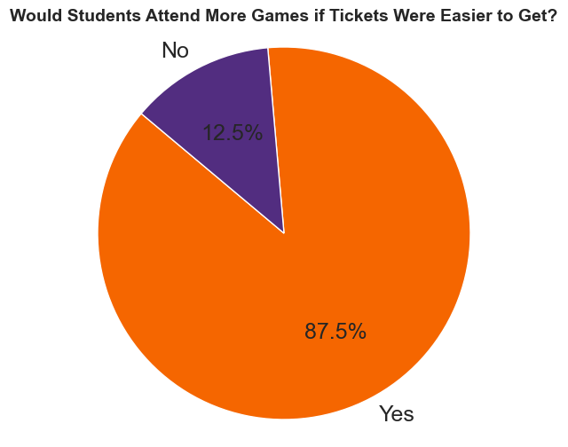
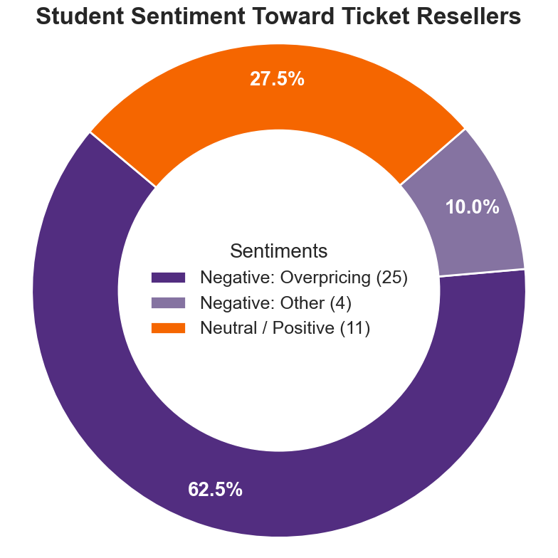

# PCID-3140-Feasibility-Report-Visuals

## Overview
This repository contains visualizations for the PCID-3140 Feasibility Report on Clemson Football ticket accessibility.

---

## Visual 1: Would Students Attend More Games if Tickets Were Easier to Get?

This pie chart demonstrates the impact of ticket accessibility on student attendance. The survey data shows student sentiment on whether easier ticket acquisition would increase their game attendance.

---

## Visual 2: Student Sentiment Toward Ticket Resellers

This donut chart presents student sentiment regarding ticket resellers. The data breaks down student opinions into three categories:
- **Negative (Overpricing)**: Students frustrated with inflated resale prices
- **Negative (Other)**: Other negative sentiments about resellers
- **Neutral/Positive**: Students with neutral or positive views

